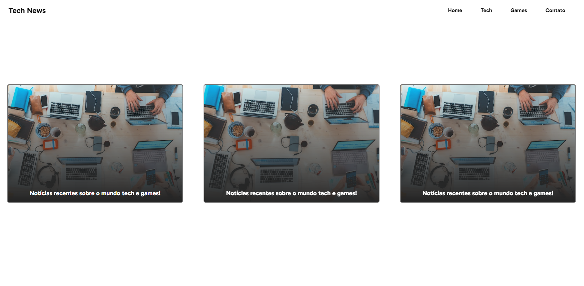

# Tech News

## Deploy do projeto

<https://tech-news-gabriel-l-santos.vercel.app/>

Projeto feito em HTML, CSS e Javascript. Este é um modelo de site de notícias de nome "Tech News", este projeto foi feito 100% do zero, sem nenhum vídeo ou curso para me guiar, tudo com base no que aprendi e nos projetos que fiz ao longo do tempo como desenvolvedor front-end. Este é apenas um esboço (sketch) de um site de notícias, pretendo fazer versões melhores e mais avançadas deste no futuro.

## Tabela de Conteúdos

- [Recursos Usados](#recursos-usados)
- [Autor do Projeto](#autor-do-projeto)

## Autor do Projeto

- GitHub - [Gabriel-L-Santos](https://github.com/Gabriel-L-Santos)
- LinkedIn - [Gabriel Leme dos Santos](https://www.linkedin.com/in/gabriel-leme-dos-santos/)